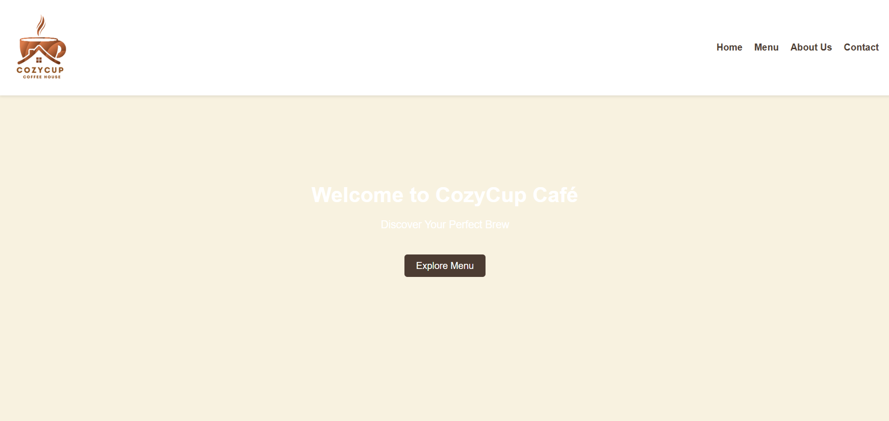
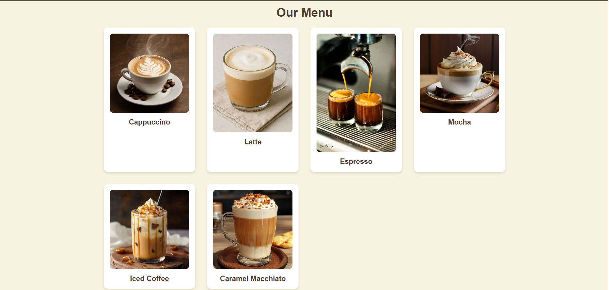
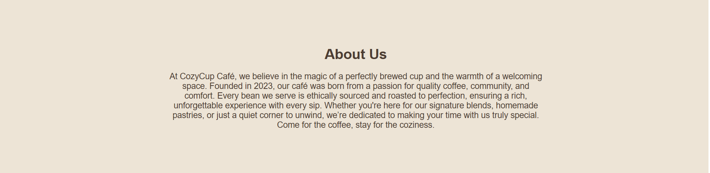
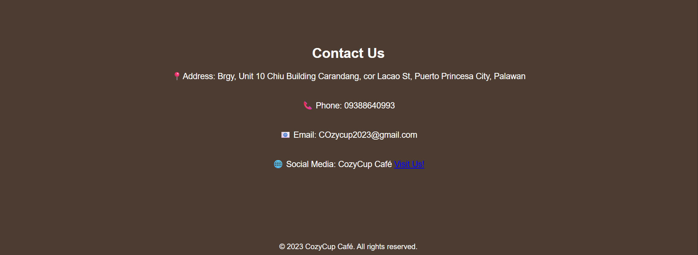

# Project Description
> This is a responsive website for CozyCup Café, a cozy coffee shop that offers a variety of coffee drinks. The website showcases the café's menu, about section, and contact information, providing customers with an online presence to learn about the café and its offerings.

## Featrues
- Responsive navigation bar with logo and menu links
- Hero section with a call-to-action button
- Menu section displaying various coffee items in a grid layout
- About Us section describing the café's philosophy
- Contact section with address, phone, email, and social media links
- Simple footer with copyright information

## Screen Captures

> **Description**: The homepage features a welcoming banner with the tagline *"Discover Your Perfect Brew"* and a call-to-action button.

> **Description**: Displays the café’s drink offerings, including Cappuccino, Mocha, Latte, and more.

> **Description**: Highlights the café’s mission, ethical sourcing practices, and cozy ambiance.

> **Description**: Includes the café’s address, phone, email, and social media links.

## About the Authors
> This project was created by Darcy & Paul Team as a website for CozyCup Café. The goal was to create an inviting online presence that reflects the café's warm and cozy atmosphere while providing essential information to customers.